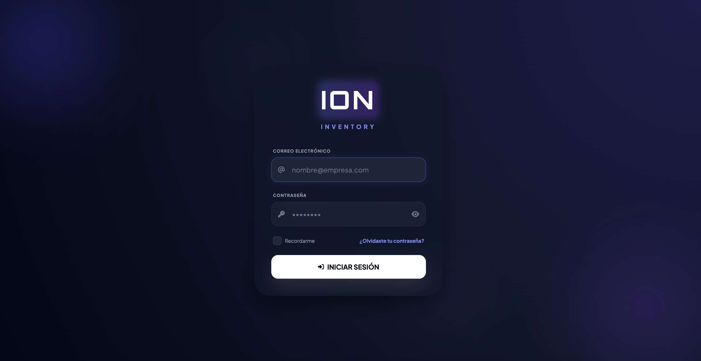
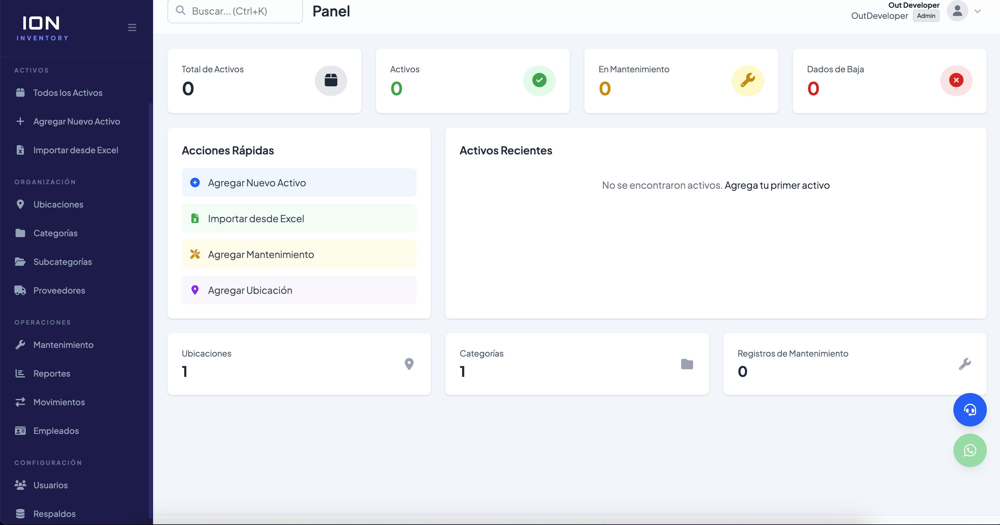
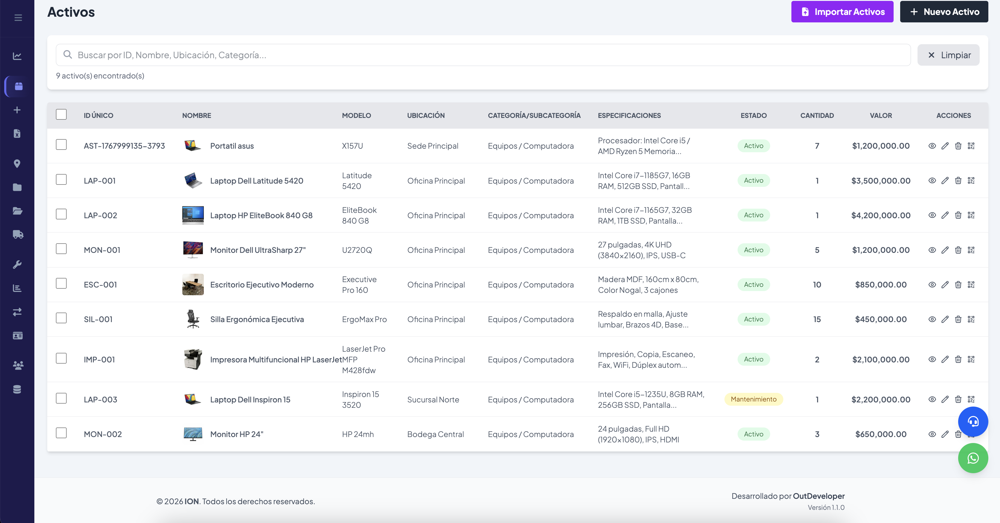
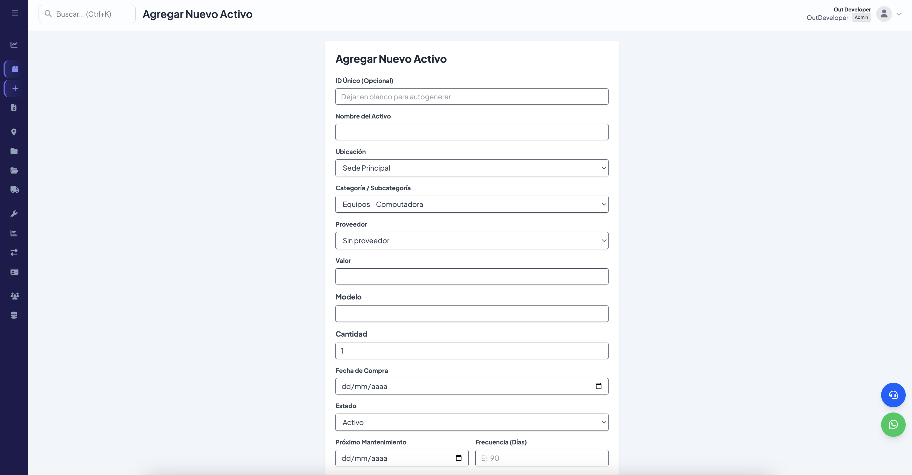
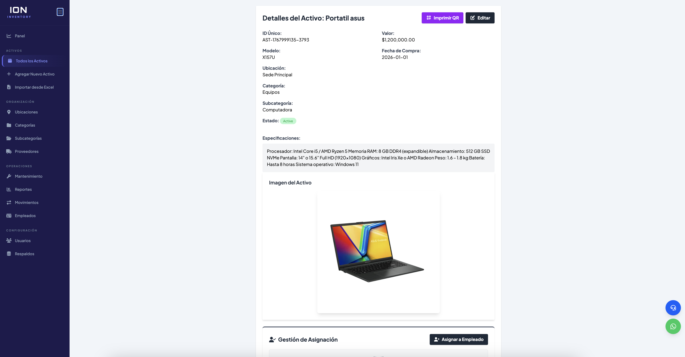
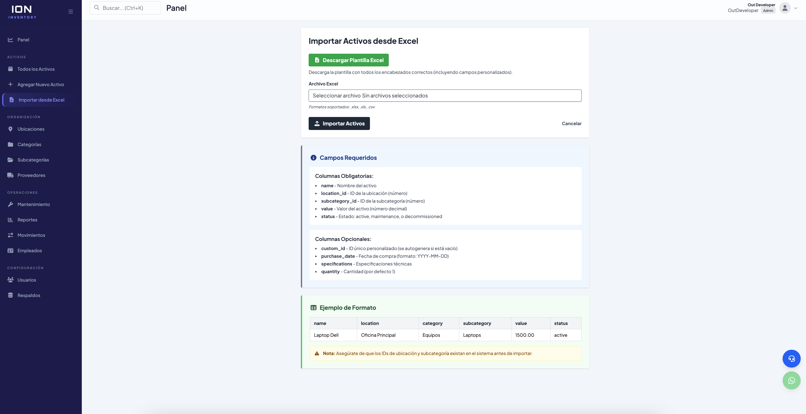
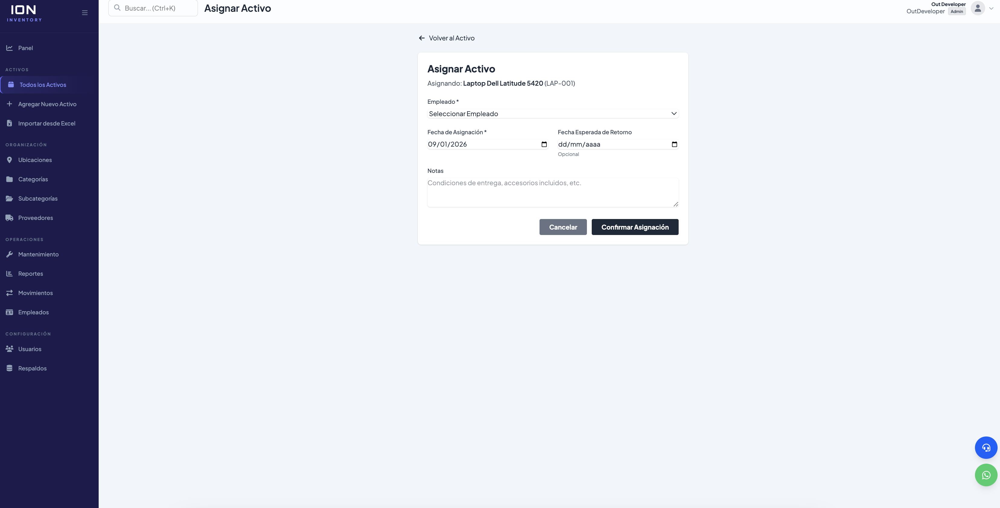
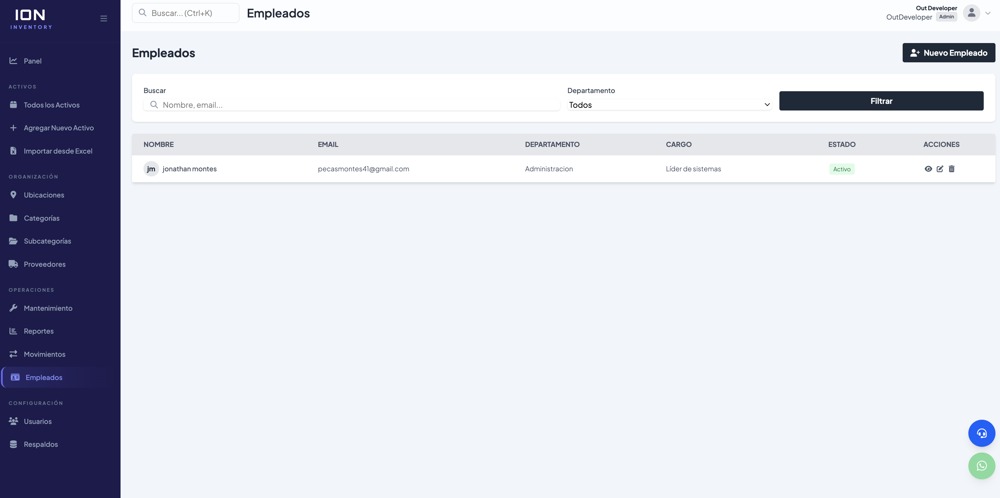
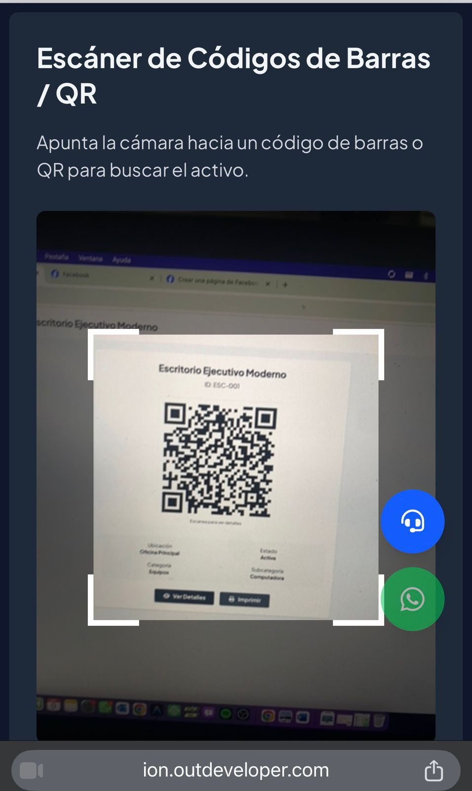

# 📘 Manual de Usuario - ION Inventory

**Versión 1.1.0**  
**Desarrollado por OutDeveloper**

---

## Tabla de Contenidos

1. [Introducción](#introducción)
2. [Inicio de Sesión](#inicio-de-sesión)
3. [Panel Principal (Dashboard)](#panel-principal-dashboard)
4. [Gestión de Activos](#gestión-de-activos)
5. [Importación Masiva desde Excel](#importación-masiva-desde-excel)
6. [Asignación de Activos a Empleados](#asignación-de-activos-a-empleados)
7. [Gestión de Empleados](#gestión-de-empleados)
8. [Mantenimiento de Activos](#mantenimiento-de-activos)
9. [Reportes y Exportación](#reportes-y-exportación)
10. [Escáner de Códigos QR](#escáner-de-códigos-qr)
11. [Configuración de Categorías y Ubicaciones](#configuración-de-categorías-y-ubicaciones)
12. [Gestión de Usuarios (Solo Administradores)](#gestión-de-usuarios-solo-administradores)
13. [Soporte Técnico](#soporte-técnico)
14. [Preguntas Frecuentes](#preguntas-frecuentes)

---

## Introducción

**ION Inventory** es un sistema completo de gestión de inventario, activos fijos y mantenimiento empresarial diseñado para ayudarte a:

-   ✅ Controlar todos tus activos desde un solo lugar
-   ✅ Asignar equipos a empleados y hacer seguimiento
-   ✅ Programar y registrar mantenimientos preventivos y correctivos
-   ✅ Generar reportes detallados en PDF y Excel
-   ✅ Escanear códigos QR para búsqueda rápida
-   ✅ Acceder desde cualquier dispositivo (PC, tablet, móvil)

---

## Inicio de Sesión

### Acceso al Sistema

1. Abre tu navegador web (Chrome, Safari, Firefox)
2. Ingresa a la URL proporcionada por tu administrador (ej: `https://ion.outdeveloper.com`)
3. Verás la pantalla de inicio de sesión

### Credenciales

-   **Correo electrónico:** El proporcionado por tu administrador
-   **Contraseña:** La contraseña que configuraste o la temporal enviada por correo

### Primer Acceso

Si es tu primera vez:

1. Ingresa con la contraseña temporal
2. El sistema te pedirá cambiarla por seguridad
3. Crea una contraseña segura (mínimo 8 caracteres, con mayúsculas, números y símbolos)

### Autenticación de Dos Factores (2FA) - Opcional

Si tu administrador habilitó 2FA:

1. Después de ingresar tu contraseña, se te pedirá un código
2. Abre tu app de autenticación (Google Authenticator, Authy)
3. Ingresa el código de 6 dígitos
4. Haz clic en "Verificar"

---

## Panel Principal (Dashboard)

Al iniciar sesión, llegarás al **Dashboard** o Panel Principal.

### Elementos del Dashboard:

#### 1. Barra Superior

-   **Menú hamburguesa** (☰): Abre/cierra el menú lateral
-   **Título de la página actual**
-   **Buscador global**: Busca activos por nombre, código o serial
-   **Icono de usuario**: Acceso a tu perfil y configuración

#### 2. Menú Lateral (Sidebar)

**Sección Activos:**

-   📦 **Todos los Activos**: Lista completa de activos
-   ➕ **Agregar Nuevo Activo**: Registrar un activo manualmente
-   📊 **Importar desde Excel**: Carga masiva de activos

**Sección Organización:**

-   📍 **Ubicaciones**: Gestionar oficinas, bodegas, sucursales
-   📁 **Categorías**: Tipos de activos (Computadores, Muebles, etc.)
-   📂 **Subcategorías**: Clasificación más específica
-   🚚 **Proveedores**: Empresas que suministran los activos

**Sección Operaciones:**

-   🔧 **Mantenimiento**: Programar y registrar mantenimientos
-   📈 **Reportes**: Generar informes en PDF/Excel
-   🔄 **Movimientos**: Historial de transferencias de activos
-   👥 **Empleados**: Gestionar personal de la empresa

**Sección Configuración:**

-   👤 **Usuarios**: Administrar cuentas (solo Admin)
-   💾 **Respaldos**: Crear copias de seguridad (solo Admin)

#### 3. Tarjetas de Estadísticas

El dashboard muestra 4 tarjetas principales:

-   **Total de Activos**: Cantidad total registrada
-   **Activos Asignados**: Equipos en uso por empleados
-   **Activos Disponibles**: Equipos sin asignar
-   **Mantenimientos Pendientes**: Tareas programadas

#### 4. Gráficos y Tablas

-   **Gráfico de Activos por Categoría**: Visualización de distribución
-   **Actividad Reciente**: Últimas acciones realizadas en el sistema
-   **Alertas de Stock Bajo**: Avisos de activos con cantidad mínima

---

## Gestión de Activos

### Ver Todos los Activos

1. Haz clic en **"Todos los Activos"** en el menú lateral
2. Verás una tabla con todos los activos registrados

**Columnas de la tabla:**

-   **Imagen**: Foto del activo
-   **Código**: Identificador único
-   **Nombre**: Descripción del activo
-   **Categoría**: Tipo de activo
-   **Estado**: Disponible, Asignado, En Mantenimiento, Dado de Baja
-   **Ubicación**: Dónde se encuentra físicamente
-   **Acciones**: Botones para Ver, Editar, Eliminar

### Crear un Nuevo Activo

1. Clic en **"Agregar Nuevo Activo"**
2. Completa el formulario:

**Campos obligatorios:**

-   **Nombre**: Ej: "Laptop Dell Latitude 5420"
-   **Código**: Identificador único (ej: "LAP-001")
-   **Categoría**: Selecciona de la lista desplegable
-   **Estado**: Disponible, Asignado, etc.
-   **Ubicación**: Oficina, bodega, etc.

**Campos opcionales:**

-   **Número de Serie**: Serial del fabricante
-   **Modelo**: Ej: "Latitude 5420"
-   **Marca**: Ej: "Dell"
-   **Proveedor**: Empresa que lo vendió
-   **Fecha de Compra**: Cuándo se adquirió
-   **Valor de Compra**: Precio pagado
-   **Garantía hasta**: Fecha de vencimiento de garantía
-   **Descripción**: Detalles adicionales
-   **Imagen**: Foto del activo (JPG, PNG)

3. Haz clic en **"Guardar"**
4. El sistema generará automáticamente un **código QR** para ese activo

### Ver Detalles de un Activo

1. En la lista de activos, haz clic en el botón **"Ver"** (ícono de ojo 👁️)
2. Se abrirá la página de detalles

**Información mostrada:**

-   Datos generales del activo
-   Código QR para imprimir
-   Historial de asignaciones
-   Historial de mantenimientos
-   Movimientos entre ubicaciones

**Acciones disponibles:**

-   **Editar**: Modificar información
-   **Asignar a Empleado**: Entregar el activo
-   **Programar Mantenimiento**: Crear tarea de mantenimiento
-   **Imprimir QR**: Descargar código QR en PDF
-   **Eliminar**: Dar de baja el activo (requiere confirmación)

### Editar un Activo

1. Clic en **"Editar"** en la lista o en la página de detalles
2. Modifica los campos necesarios
3. Haz clic en **"Actualizar"**

### Eliminar un Activo

⚠️ **Precaución**: Esta acción no se puede deshacer.

1. Clic en **"Eliminar"** (ícono de papelera 🗑️)
2. Confirma la acción en el mensaje emergente
3. El activo será marcado como "Dado de Baja"

---

## Importación Masiva desde Excel

Si tienes muchos activos, puedes importarlos todos de una vez usando un archivo Excel.

### Paso 1: Descargar la Plantilla

1. Ve a **"Importar desde Excel"**
2. Haz clic en **"Descargar Plantilla"**

3. Se descargará un archivo `plantilla_activos.xlsx`

### Paso 2: Llenar la Plantilla

Abre el archivo Excel y completa las columnas:

| Código  | Nombre      | Categoría    | Marca | Modelo   | Serial | Estado     | Ubicación         | Valor   |
| ------- | ----------- | ------------ | ----- | -------- | ------ | ---------- | ----------------- | ------- |
| LAP-001 | Laptop Dell | Computadores | Dell  | Latitude | ABC123 | Disponible | Oficina Principal | 1500000 |

**Notas importantes:**

-   El **Código** debe ser único para cada activo
-   La **Categoría** y **Ubicación** deben existir previamente en el sistema
-   El **Estado** debe ser uno de: Disponible, Asignado, En Mantenimiento, Dado de Baja

### Paso 3: Importar el Archivo

1. Haz clic en **"Seleccionar Archivo"**
2. Elige tu archivo Excel completado
3. Clic en **"Importar"**
4. El sistema procesará el archivo y mostrará un resumen:
    - ✅ Activos importados correctamente
    - ⚠️ Errores encontrados (si los hay)

---

## Asignación de Activos a Empleados

### Asignar un Activo

1. Ve a la página de detalles del activo
2. Haz clic en **"Asignar a Empleado"**

3. Completa el formulario:

    - **Empleado**: Selecciona de la lista
    - **Fecha de Asignación**: Por defecto es hoy
    - **Notas**: Observaciones adicionales (opcional)

4. Haz clic en **"Asignar"**

### Ver Asignaciones Activas

En la página del activo, verás la sección **"Asignaciones"**:

-   Empleado actual
-   Fecha de asignación
-   Botón para **"Devolver Activo"**

### Devolver un Activo

1. En la página del activo, sección "Asignaciones"
2. Haz clic en **"Devolver"**
3. Confirma la devolución
4. El activo vuelve al estado "Disponible"

---

## Gestión de Empleados

### Agregar un Empleado

1. Ve a **"Empleados"** en el menú lateral
2. Clic en **"Agregar Empleado"**

3. Completa los datos:

    - **Nombre Completo**
    - **Identificación** (Cédula/DNI)
    - **Cargo**
    - **Departamento**
    - **Correo Electrónico**
    - **Teléfono**

4. Haz clic en **"Guardar"**

### Ver Activos Asignados a un Empleado

1. En la lista de empleados, haz clic en **"Ver"**
2. Verás todos los activos que tiene asignados

---

## Mantenimiento de Activos

### Programar un Mantenimiento

1. Ve a **"Mantenimiento"** en el menú lateral
2. Clic en **"Programar Mantenimiento"**

3. Completa:

    - **Activo**: Selecciona el equipo
    - **Tipo**: Preventivo o Correctivo
    - **Fecha Programada**
    - **Descripción**: Qué se va a hacer
    - **Costo Estimado** (opcional)
    - **Proveedor** (si es externo)

4. Haz clic en **"Guardar"**

### Registrar un Mantenimiento Realizado

1. En la lista de mantenimientos, busca el pendiente
2. Haz clic en **"Completar"**
3. Ingresa:

    - **Fecha de Realización**
    - **Costo Real**
    - **Notas**: Qué se hizo exactamente

4. Haz clic en **"Guardar"**

El mantenimiento cambiará a estado "Completado".

---

## Reportes y Exportación

### Generar un Reporte

1. Ve a **"Reportes"** en el menú lateral

2. Selecciona los filtros:

    - **Categoría**: Todos o una específica
    - **Estado**: Todos, Disponibles, Asignados, etc.
    - **Ubicación**: Todas o una específica
    - **Rango de Fechas**: Desde - Hasta

3. Elige el formato:

    - **PDF**: Para imprimir o compartir
    - **Excel**: Para análisis de datos

4. Haz clic en **"Generar Reporte"**

### Tipos de Reportes Disponibles

-   **Inventario General**: Todos los activos
-   **Activos por Categoría**: Agrupados por tipo
-   **Activos por Ubicación**: Agrupados por lugar
-   **Activos Asignados**: Solo los que están en uso
-   **Historial de Mantenimientos**: Todos los mantenimientos realizados
-   **Valorización de Activos**: Valor total del inventario

---

## Escáner de Códigos QR

### Usar el Escáner (Solo en Móvil)

1. En el menú lateral, haz clic en **"Escáner"** (solo visible en móvil)

2. Haz clic en **"Iniciar Escáner"**
3. Permite el acceso a la cámara cuando el navegador lo solicite
4. Apunta la cámara hacia el código QR del activo
5. El sistema detectará automáticamente el código y te redirigirá a la página del activo

### Imprimir Códigos QR

1. Ve a la página de detalles de cualquier activo
2. Haz clic en **"Imprimir QR"**
3. Se descargará un PDF con el código QR
4. Imprime y pega en el activo físico

---

## Configuración de Categorías y Ubicaciones

### Crear una Categoría

1. Ve a **"Categorías"**
2. Clic en **"Agregar Categoría"**
3. Ingresa:

    - **Nombre**: Ej: "Computadores"
    - **Descripción**: Detalles adicionales

4. Haz clic en **"Guardar"**

### Crear una Ubicación

1. Ve a **"Ubicaciones"**
2. Clic en **"Agregar Ubicación"**
3. Ingresa:

    - **Nombre**: Ej: "Oficina Principal"
    - **Dirección**: Dirección física
    - **Descripción**: Detalles adicionales

4. Haz clic en **"Guardar"**

### Crear un Proveedor

1. Ve a **"Proveedores"**
2. Clic en **"Agregar Proveedor"**
3. Completa:

    - **Nombre**: Nombre de la empresa
    - **NIT/RUC**: Identificación tributaria
    - **Contacto**: Persona de contacto
    - **Teléfono**
    - **Correo Electrónico**

4. Haz clic en **"Guardar"**

---

## Gestión de Usuarios (Solo Administradores)

### Crear un Usuario

1. Ve a **"Usuarios"** (solo visible para administradores)
2. Clic en **"Agregar Usuario"**

3. Completa:

    - **Nombre Completo**
    - **Correo Electrónico**
    - **Contraseña Temporal**
    - **Rol**: Administrador o Usuario

4. Haz clic en **"Crear"**

El usuario recibirá un correo con sus credenciales.

### Roles y Permisos

**Administrador:**

-   Acceso total al sistema
-   Puede crear/editar/eliminar activos
-   Puede gestionar usuarios
-   Puede crear respaldos
-   Puede ver todos los reportes

**Usuario:**

-   Puede ver activos
-   Puede crear activos (si el admin lo permite)
-   No puede eliminar activos
-   No puede gestionar usuarios

---

## Soporte Técnico

### Crear un Ticket de Soporte

1. Ve a **"Soporte"** en el menú lateral
2. Clic en **"Crear Ticket"**

3. Completa:

    - **Asunto**: Resumen del problema
    - **Descripción**: Explica detalladamente
    - **Prioridad**: Baja, Media, Alta
    - **Adjuntos**: Capturas de pantalla (opcional)

4. Haz clic en **"Enviar"**

### Ver Estado de tus Tickets

1. En **"Soporte"**, verás la lista de tus tickets
2. Estados posibles:
    - 🟡 **Abierto**: Recién creado
    - 🔵 **En Proceso**: El equipo está trabajando en ello
    - 🟢 **Resuelto**: Problema solucionado
    - 🔴 **Cerrado**: Ticket finalizado

---

## Preguntas Frecuentes

### ¿Puedo usar ION desde mi celular?

Sí, ION es completamente responsive y funciona en cualquier dispositivo móvil.

### ¿Los datos están seguros?

Sí, todos los datos están encriptados y se realizan respaldos automáticos diarios.

### ¿Puedo exportar mi información?

Sí, puedes exportar reportes en PDF y Excel en cualquier momento.

### ¿Cuántos usuarios puedo tener?

Depende de tu plan contratado. Consulta con tu administrador.

### ¿Qué pasa si olvido mi contraseña?

En la pantalla de login, haz clic en "¿Olvidaste tu contraseña?" y sigue las instrucciones.

### ¿Puedo personalizar las categorías?

Sí, los administradores pueden crear categorías personalizadas según las necesidades de la empresa.

### ¿El sistema funciona sin internet?

No, ION requiere conexión a internet para funcionar. Sin embargo, estamos trabajando en una versión offline.

---

## Contacto y Soporte

**OutDeveloper**  
📧 Email: soporte@outdeveloper.com  
🌐 Web: https://outdeveloper.com  
📱 WhatsApp: [Número de contacto]

**Horario de Atención:**  
Lunes a Viernes: 8:00 AM - 6:00 PM  
Sábados: 9:00 AM - 1:00 PM

---

**© 2026 OutDeveloper. Todos los derechos reservados.**
